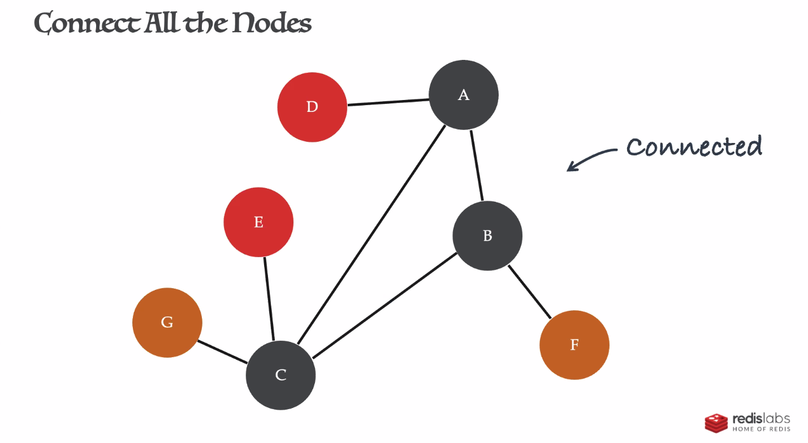

# Dungeons, Dragons, and Graph Databases

## what is a graph?
* nodes and vertices, like a d20

* connected means every node is connected to another node and each node can be reached from any other node

* this graph is also "undirected", there is no real direction of relationships between nodes
* degrees of a node - number of relationships it has

* anything can connect to anything
* nodes can even connect to themselves
* no real rules on connections, a can connect to b 500 times
* add some data

* the relationships can read like a sentence
    * the room contains a monster

## how to solve a data problem
* can use sql, or could use graph db
* use cypher for querying graph dbs
    * using matching syntax
    * 
    * this will match any room that contains a monster

## CRUD

* there is another syntax that is pretty similar to calling functions with json

## so what's the big difference?
* no schema
* connections
    * in sql we need mapping tables to directionally map
    * in graph db we also create relationships but in a slightly different way
        * no real limitations on what can be connected and which directions
        * no defined structure for connections
* querying with joins
    * sql
        * complicated connections can require large join queries that are hard to read and maintain
    * graph
        * can query variable length relationships (node distance)
        * uses pathing algorithms for querying
        * can ask questions like 
            * what are the rooms that are nearby with gold?
            * what is the longest path in the dungeon?
* just look at this query, pretty cool 

## demo
https://github.com/guyroyse/dnd-and-graph-databases
* he wrote a random dungeon generator in js

* queried for shortest path to the most gold

## practical applications

## Q&A
* how would you do the equivalent of grouping in graph - e.g. if there were multiple enemies there might be more XP in another room.
    * it can be done with matches
* Why should I use graph?
    * use it when it makes sense, it doesn't always apply
* efficiency vs sql?
    * they are generally slower than a relational db for large datasets
    * either compact and slow or very large and fast
    * there are balanced solutions
* how to prevent type errors?
    * you can't really, make sure your queries are correct because there isn't schema
* can redis graphs be sharded?
    * no
    * they can be replicated