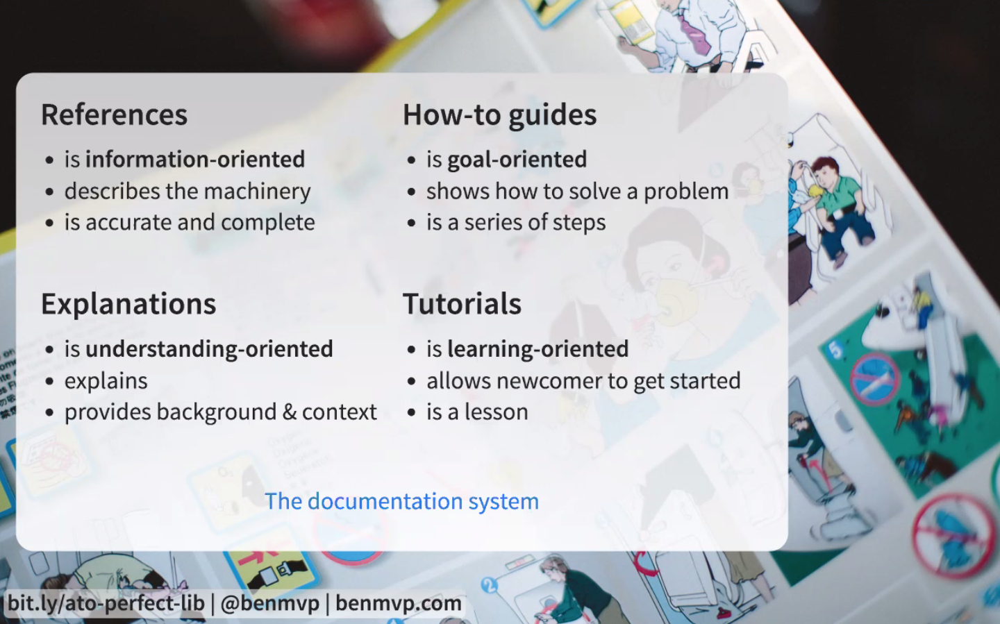
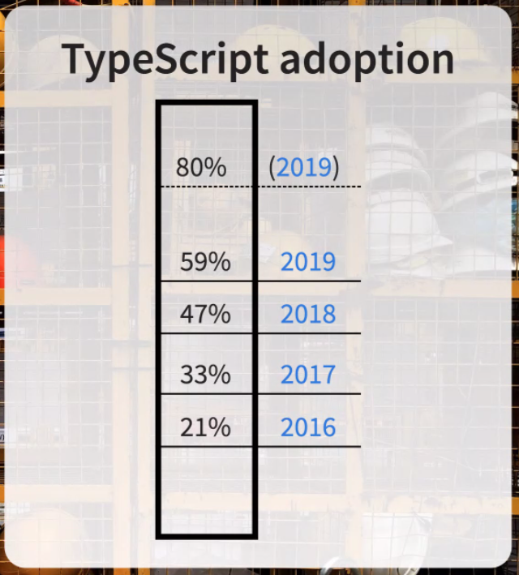
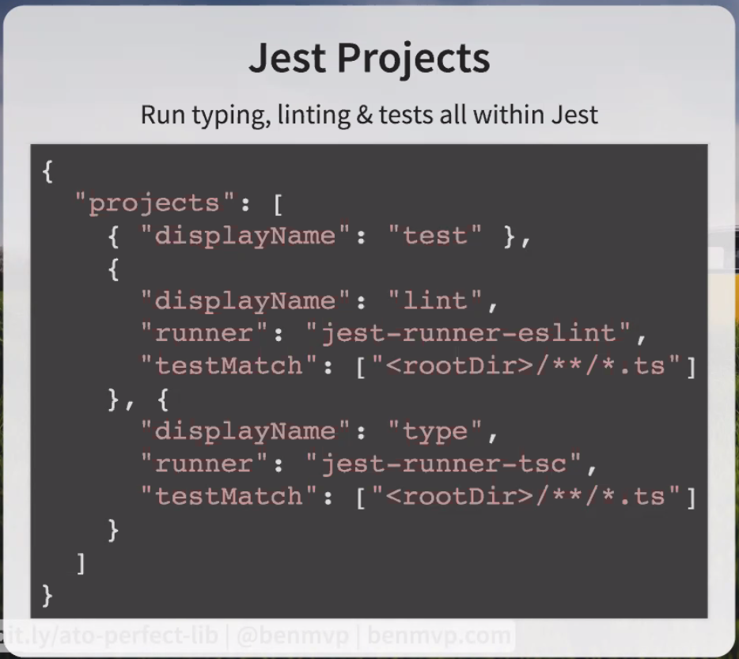
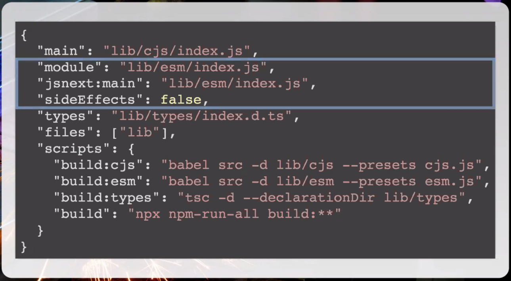
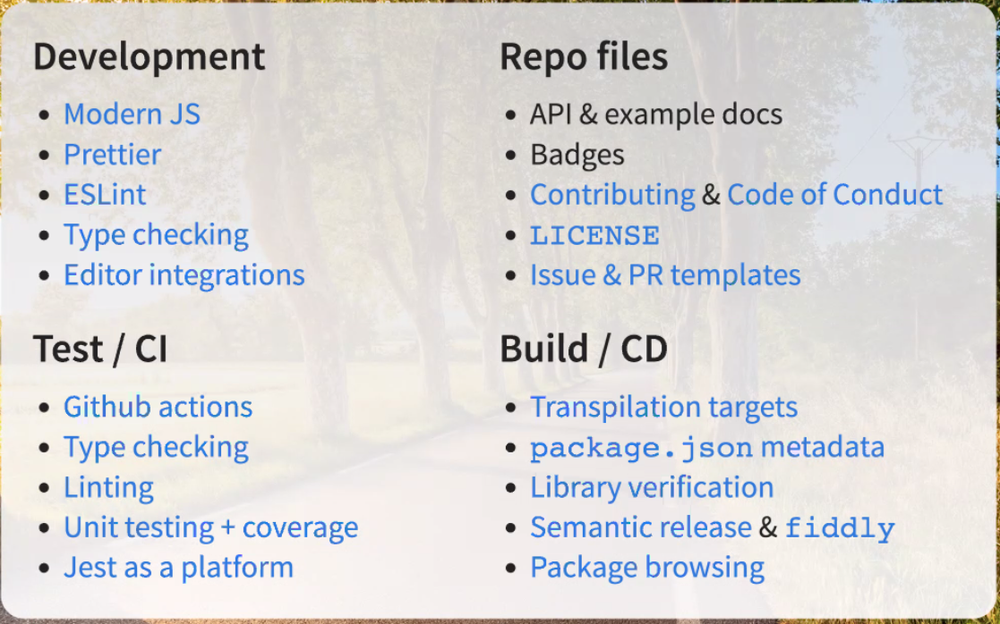

# The "Perfect" JS Library Tooling
https://slides.benmvp.com/2020/ato/perfect-lib.html#/
## what makes a good app
* users === developers
* helpful docs
    * how to install, use, and spec
* write the docs first
    * documentation driven development
    * why? writing good docs is hard
    * get feedback before starting work on the app
* what sort of docs?

* include both npm and yarn instructions
* typescript types
    * flow types?
* 

## bug free library
* type checking with typescript
* linting with eslint
* testing + coverage with jest

## jest projects
* you can run type checking, linting, and testing all through one command
* 

## changing quickly
* start by getting as much info as possible for the bug or feature
* dev x files
    * .github/pull_request_template.md
    * .nvmrc
    * .prettierrc.json
    * code_of_conduct.md
    * contributing.md
* esm - tree shaking
* cjs

* can use semantic-release in ci to release on every build

## recap

* @benmvp/cli does a lot of this for you
    * https://github.com/benmvp/benmvp-cli
    * made by the presenter
    * works a lot like react scripts