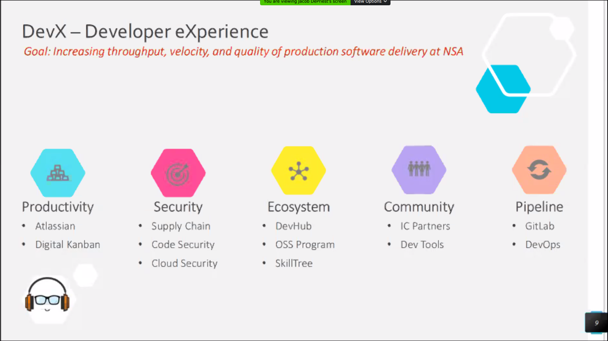

# Open Source, DevOps, & Tele-work at the NSA

## "DevX"
* developer experience (internal term in the nsa, but also a website that isn't related)
* goal - increase throughput, velocity, & quality

* very restricted internet access because working at the nsa
    * air-gap
* security is a large concern

## git lab
* top secret AWS instance
* took a lot of practice to transfer
* developers are much happier, as they should be
* still have some project on internal servers

## tele-work
* can an intelligence agency support tele-work?
    * yes
* historically not prevalent
* protected "lowside" development environment
    * commercial cloud services
    * wrapped with lots of security
    * ongoing for 3-4 years
    * secure enough to use from home
* they use microsoft 365
* not **all** work can be moved to an unclassified environment
* do employees have the proper training?
* the agency tries to embrace all these new technologies as much as public companies
    * with some obvious restrictions

## Q&A
* when do you decide when to go open source?
    * it depends on the sensitivity of the project
    * open source is becoming more prevalent so they are thinking about it more from day 1
    * skilltree is an example with this
* which chat app?
    * MS office 365
    * MS teams
* are projects built into private/public branches?
    * they focus on modularity for their projects instead of something like that
* do you need specialized security knowledge to work at the nsa or do you learn on the way?
    * yes and no, some positions have higher requirements
    * working in other parts of the government and knowing about their security is helpful
* what is considered "top secret"?
    * they have to ask themselves this a lot
    * generally: is there anything sensitive about the effort that would compromise our data
        * maybe the software is fine but the data can be sensitive
        * separate the two so software can be released
* what does nsa get out of open-source?
    * primary goal for oss is the community aspect, many employees come from an oss background
    * many employees are passionate about oss as civil servants
* sometimes classifying software could hide capabilities
    * this is part of the review process but pretty similar to the public sector, don't want to reveal too much