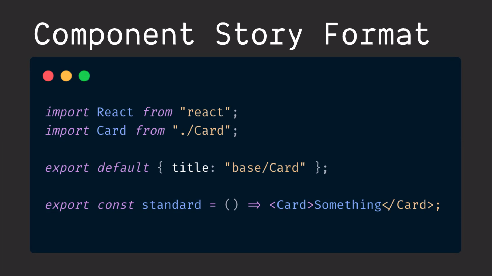
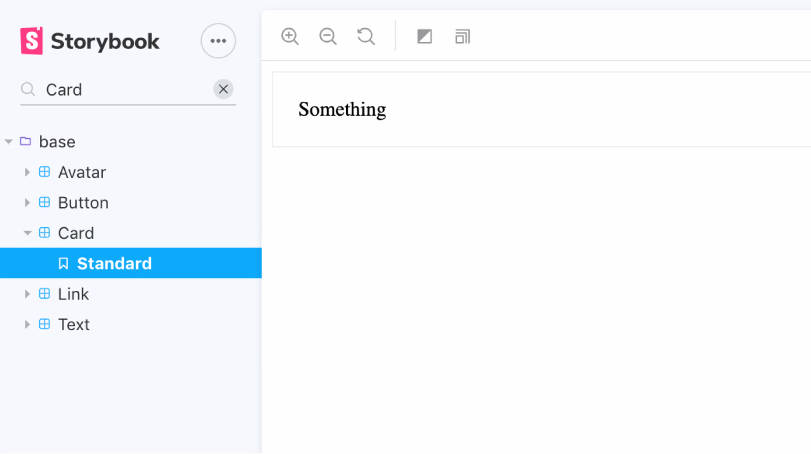
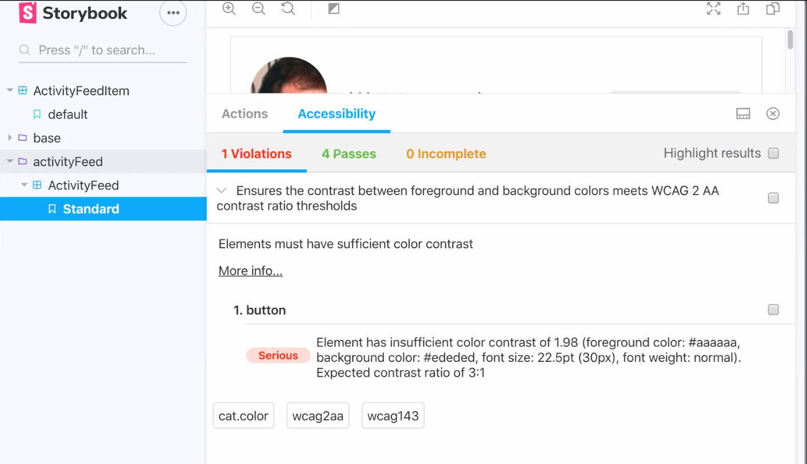
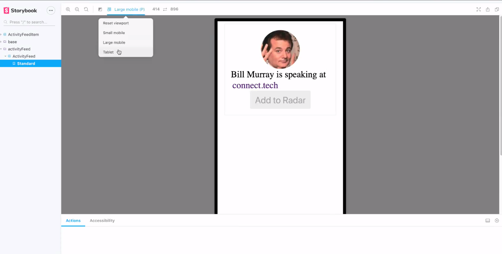
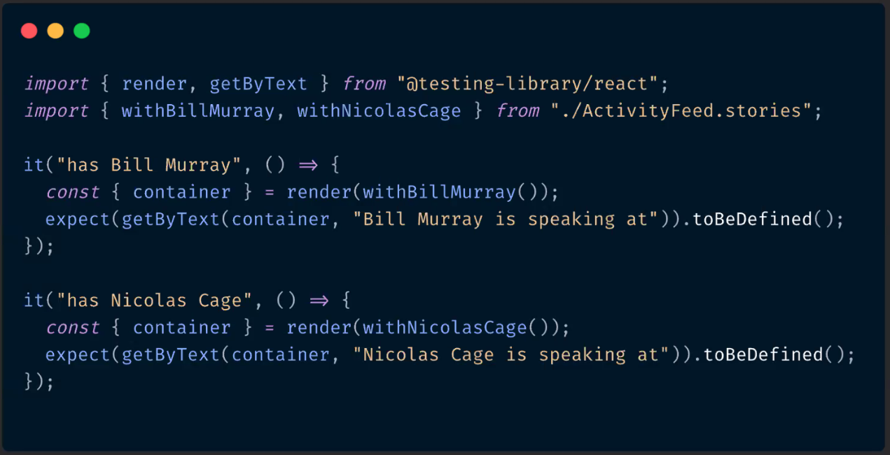
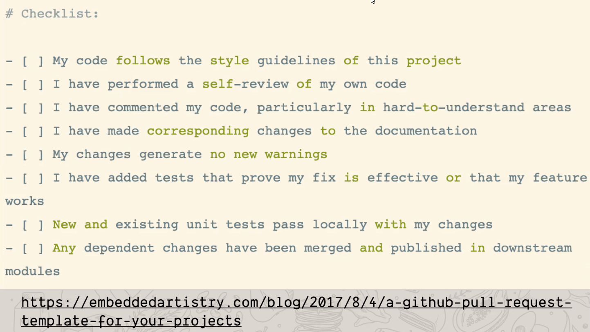

# Beyond Spaghetti: Cooking Up Better Front-end Applications w/ Inspiration from the Culinary world

## storybook
* jumped into this one, I think this is some new syntax 

* this presenter seems to like react development with storybook
* use smaller components and build them in isolation
* storybook plugins
    * accessability plugin
    
    * viewport plugin
    
* @testing-library/react
    * lets you render stories and test
    
    * treated as part of unit-testing so it is more likely to stay up to date

## components
> "duplication is far cheaper than the wrong abstraction" 

-sandi metz

## checklists
* every cooking operation has a step list
* create a PR template checklist

* create a todo list per feature and open a draft PR wit this todo list as part of the description

## automation
* don't use humans for jobs computers can do
    * *if you can afford it
* cli
    * https://www.npmjs.com/package/gluegun

## Q&A
* should things be organized by feature or by technology?
    * depends on preference
    * ...but by feature