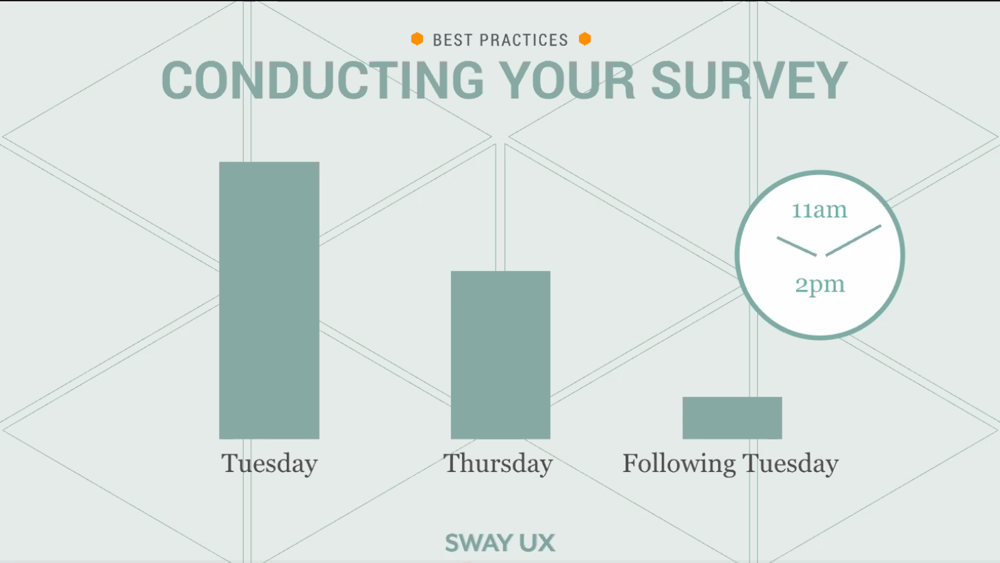
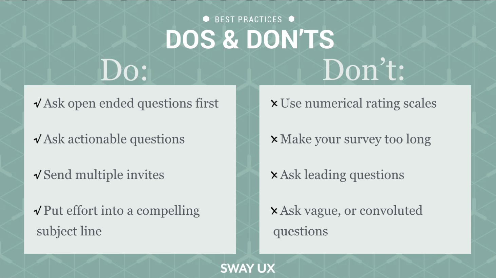

# Better Surveys

## what makes a bad survey?
* certain types of questions
    * rate from very good to very bad
* stay away from 1-10 ranking scale
    * example: rate your breakfast from 1-10
    * example: how likely are you to recommend this thing to a friend
        * fixed: would you recommend this to a friend yes or no
* don't ask leading questions
    * example: "how short was napoleon"
    * better: "how would you describe napoleon's height"
* don't use "intercepts" (pop-ups on a page when you're doing something)
    * they are irritating
    * don't interrupt an active task
## what makes a good survey?
* ask about one thing at a time
    * example: did you enjoy your breakfast yes or no?
* don't use jargon
* ranking systems
    * rank the most important things about your breakfast: taste, nutrition, calories, ease, price, etc.
    * much better data to get information from
* avoid abbreviations
* be clear and brief
* have some form of self-identification question so you can segment your data into different groups
* ask some open-ended questions
    * 2 or 3 of them is reasonable
    * ask them first
        * this is important because if asked last users will answer in the same way the previous questions were asked
        * so you don't anchor their language with your word choices 
* use a survey platform such as survey monkey or survey gizmo
    * (presenters are not sponsored by these companies, other survey platforms are available)
* allow 1-2 weeks to collect responses
* send 2 reminder emails for the survey

* subject line can make or break the survey, craft if carefully
    * include words such as "Invitation:" or "Reminder:"
    * consider including the estimated time to complete
    * examples:
        * Invitation: tell us how you feel in 2 minutes
        * Invitation: Happier patients in 4 minutes
        * Reminder: Reduce carbon emissions, a 3 minute survey
* always use surveys **before** building something
    * it's also never too late to conduct a survey
## do's and dont's

## real world examples
* company went with their gut and spent a lot of time on a product
    * 2 question exit survey: "did you find what you were looking for, yes or no?"
    * 60% said no
    * the other 40% found were users that the company didn't really create the site for
    * "no, I was looking for: [fill in the blank]"
        * they wanted to see more specific types of data
    * company was able to make their site actually useful for their users
## sample objectives
* planning the ato conference for next year
    * which open source technology do you anticipate will be important to your role within the next two years?
    * what’s one thing you would change about this years conference?
* office manager: what to people need to feel good about returning to the office?
    * would you feel comfortable if certain precautions were taken?
    * what precautions are important to you? (list of items with checkboxes)
        * choose top 3
    * how do you feel about returning to the office? (open-ended)
    * do you have any family members at high risk? (segmenting)