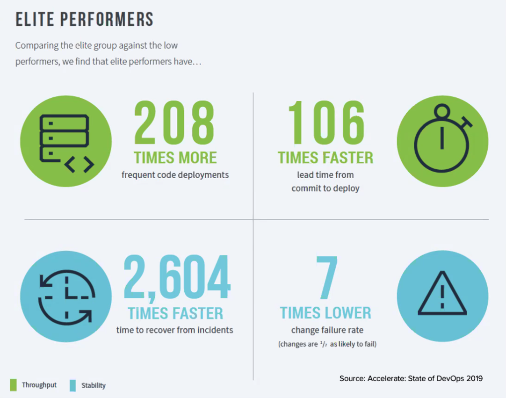
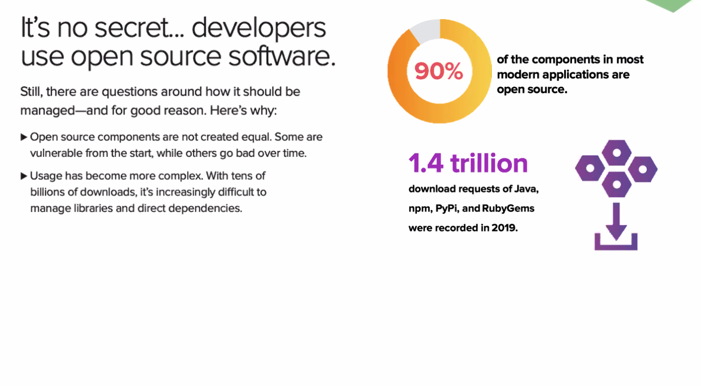
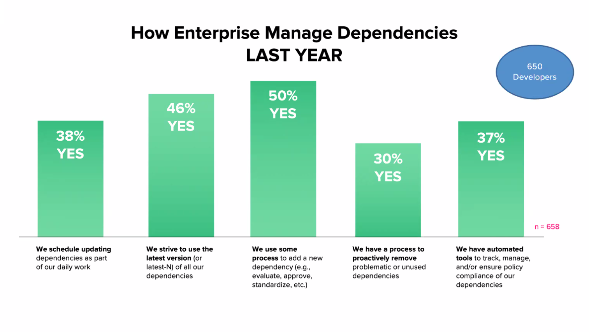
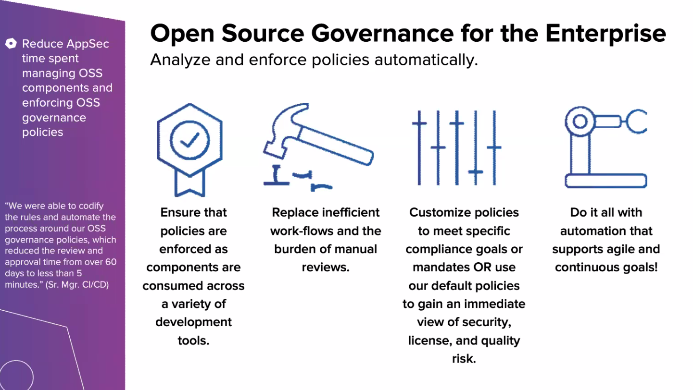
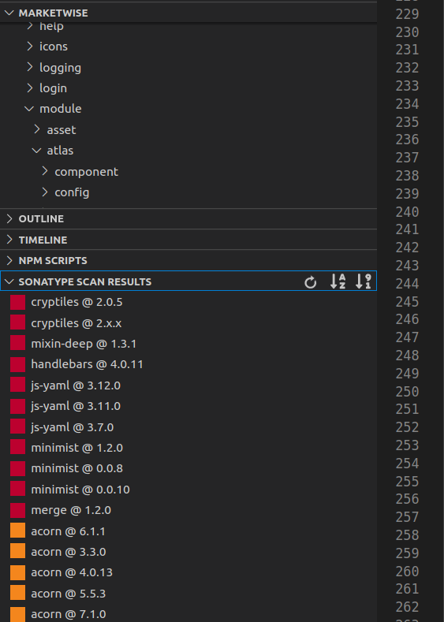

# Yes, your applications are under attack...
Protecting each step of the dev lifecycle
## Overview
* we all know the benefits of using these new tools

* using oss (about 90% now on average)

* managing dependencies by hand is really time consuming
* better to automate

* cyber-crime trade is bigger than the drug trade

## example
https://github.com/sonatype-nexus-community/struts2-rce
* let's see what github says about the security
    * enable "issues" in security settings
    * enable dependency graph under insights
    * set up a security policy
* github found some vulns in the pom
* fork & clone down to local box
* tip - you can set up your hosted maven registry to auto-block vulnerable packages
    * maven install would fail for this project if that was enabled
* install from global maven registry
* build with docker
* the struts2 exploit is in the python file exploit.py
    * if only it were that easy to identify in practice
* will generate a post payload
    * execute command on the host machine
    * basically you can run any command on the host machine through a post call and it will return the result
    * host machine has root (of course) so anyone now has full access to that machine!
```
./mvnw clean package in project root 
docker build -t hackme . 
docker run -d -p 9080:8080 hackme 
If 9080 is already used on your local machine, pick another port 
Once container comes online - verify by running in browser http://localhost:9080 
Run the exploit 
python2 exploit.py http://localhost:9080/orders/3 "whoami" 
2to3 -w exploit.py if you have python3 
———— 
Clair 
————
https://github.com/quay/clair 
The Server & DB 
mkdir $PWD/clair_config 
curl -L https://raw.githubusercontent.com/coreos/clair/master/config.yaml.sample -o $PWD/clair_config/config.yaml 
Edit /config/config.yaml Line 23 (adding password=password) 
source: host=clairdb port=5432 user=postgres password=password sslmode=disable statement_timeout=60000 
Start the docker environment 
docker network create clairnet 
docker run -d -e POSTGRES_PASSWORD=password --name clairdb --network clairnet postgres:9.6 
docker run --net=clairnet --name clair -d -p 6060-6061:6060-6061 -v $PWD/clair_config:/config quay.io/coreos/clair:latest -config=/config/config.yaml 
```
## how do I know if my project is vulnerable?
* use the github tools
    * bitbucket alternatives? maybe there are some plugins
    * a good start, but not a complete solution
* clair scanner
    * https://github.com/quay/clair
    * will check against known CVEs and report back
    * can scan against the OS of the host machine itself
* always start scanning early

sonatypecommunity.vscode-iq-plugin

## some free developer tools
https://www.sonatype.com/nexus/free-developer-tools
* all free and oss
* _nice_

## vscode extension
sonatypecommunity.vscode-iq-plugin
* sonatype extension in vscode (works with java, javscript, and probably others too)
* smacks all the vulnerabilities right in your face so you can't really ignore them
* will let you know which versions of that same package are safe so you can upgrade quickly
* it's pretty easy to use compared to some of the other vuln scanners I've used



## sonatype oss index
https://ossindex.sonatype.org/integrations
* useful tool for automating dependency resolution
* according to them it's the **best** data source for vulnerabilities
* the tools actually look pretty good too
* lots of integrations with many tools and languages
* nexus IQ can be pointed at a repository manager and do scans, it has a pretty nice UI and automation tools
    * this is what also can block packages from being installed in the registry
* scales well for multiple applications to assess risks quickly