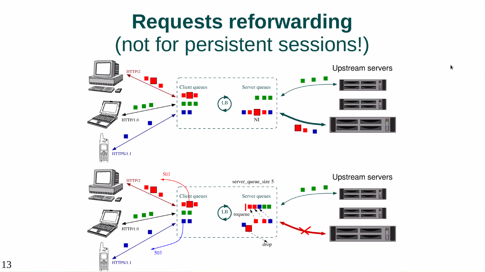

# Web Acceleration Mechanics

## what is a web accelerator

## server connections

* keep alive connections number can be vulnerable to ddos attacks
* server must reply to requests in order

## HTTP/1

* actually interpreted as 2 requests by the server, second request is the attack

## HTTP/2
* http/2 can reply in different order
    * responses can be sent in parallel and in any order
    * improves performance of backend connections
* provides some compression
* drawback - several zero copy techniques don't work

## reforwarding

## proxy buffering & streaming

## stopped here, this is way above my head and the presenter is going very fast